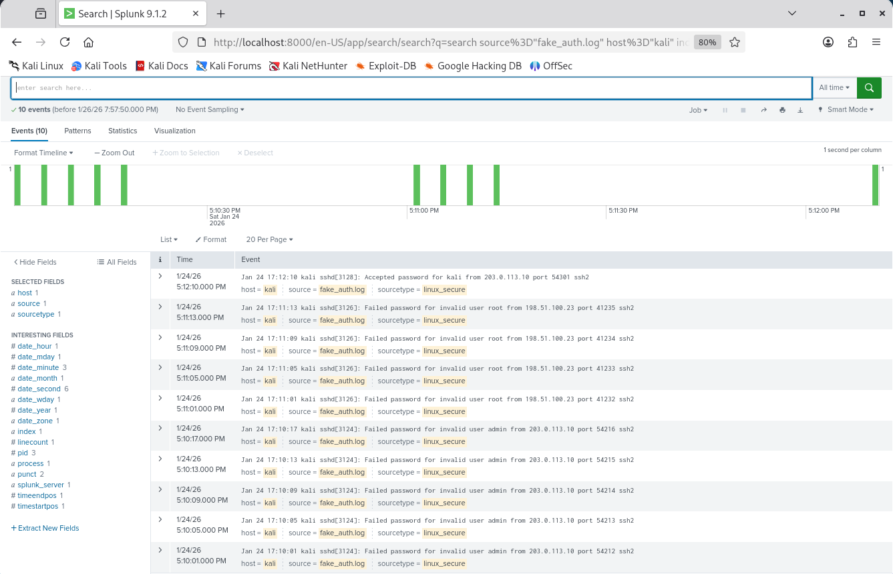
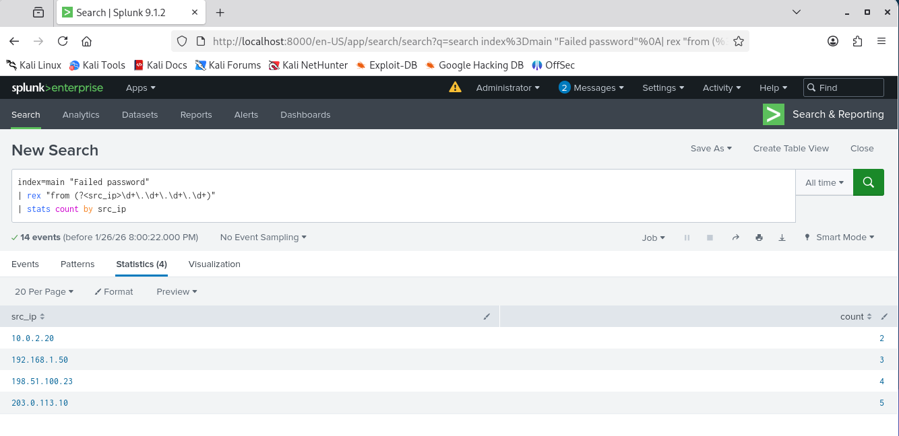
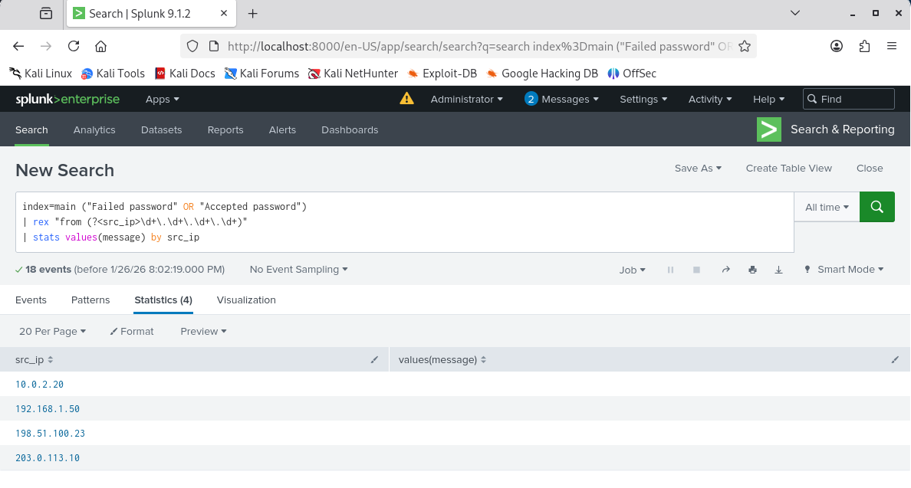

# Splunk SIEM Log Triage with MITRE ATT&CK Mapping

## Project Objective
This project demonstrates hands-on **SOC analyst skills** using **Splunk SIEM** to perform log triage, detect SSH brute-force activity, and map observed attacker behavior to the **MITRE ATT&CK framework**.  

The workflow simulates a real-world **incident investigation** using Linux authentication logs. Focus is on **detection logic, investigation methodology, and threat classification**, not basic tool usage.

---

## Environment Setup
- **SIEM:** Splunk Enterprise  
- **Log Source:** Simulated Linux authentication logs  
- **Log Type:** SSH authentication events  
- **Platform:** Kali Linux

---

## Detection Use Cases
- Multiple failed SSH login attempts from a single source IP  
- Brute-force attempts against invalid users  
- Successful login following repeated failures  
- Timeline correlation of attack activity

---

## MITRE ATT&CK Mapping

| Technique ID | Technique Name            | Description |
|-------------|--------------------------|-------------|
| T1110       | Brute Force               | Repeated failed SSH login attempts observed from attacker IPs |
| T1078       | Valid Accounts            | Successful login following brute-force attempts |
| T1021.004   | Remote Services: SSH      | SSH used as the access method |

---

## Screenshots & Observations

### 1. Fake Log Ingestion
  
**Observation:** Simulated Linux authentication logs were ingested into Splunk successfully. The dataset contains both failed and successful SSH login attempts, providing a realistic environment for SOC-level analysis.

### 2. SSH Brute Force Detection (T1110)
  
**Observation:** SPL query identifies multiple failed login attempts by source IP. High failure count indicates brute-force attack patterns.

### 3. Failed to Successful Login Correlation (T1078)
  
**Observation:** Correlating failed and successful logins reveals potential account compromise. SOC analysts can track attacker progression from brute-force to valid authentication.

### 4. Attack Timeline Investigation
  
**Observation:** Timeline visualization shows sequence of login attempts and successful authentication. Supports incident reconstruction and threat analysis.

---

## Sample SPL Queries

### Detect SSH Brute Force (T1110)
```spl
index=main "Failed password"
| rex "from (?<src_ip>\d+\.\d+\.\d+\.\d+)"
| stats count by src_ip
```
Correlate Failed → Successful Login (T1078)
```spl
index=main ("Failed password" OR "Accepted password")
| rex "from (?<src_ip>\d+\.\d+\.\d+\.\d+)"
| stats values(message) by src_ip
```
Timeline Analysis
```spl
index=main
| rex "from (?<src_ip>\d+\.\d+\.\d+\.\d+)"
| sort _time
```
## Investigation Summary
- Multiple failed SSH login attempts detected from a single external IP
- Attempts targeted invalid users → clear brute-force behavior
- Successful login observed after repeated failures → potential credential compromise
- Timeline supports full incident reconstruction

## Skills Demonstrated
- SIEM log ingestion and analysis
- Security event triage
- SPL query development
- MITRE ATT&CK mapping
- Incident investigation workflow
