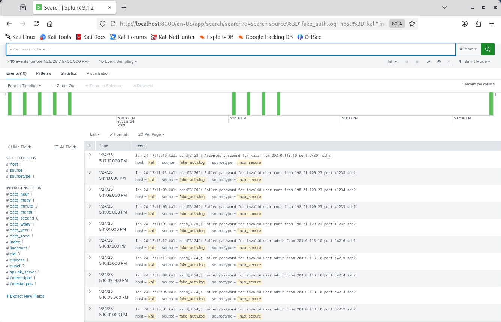
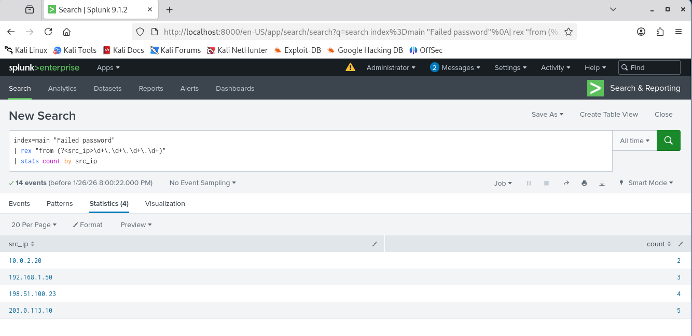
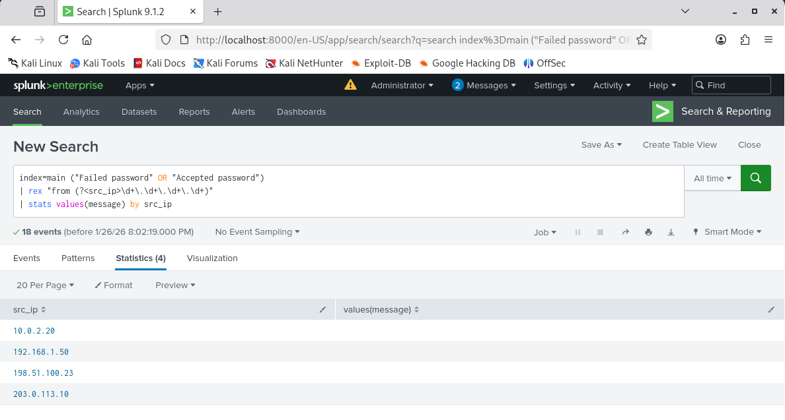
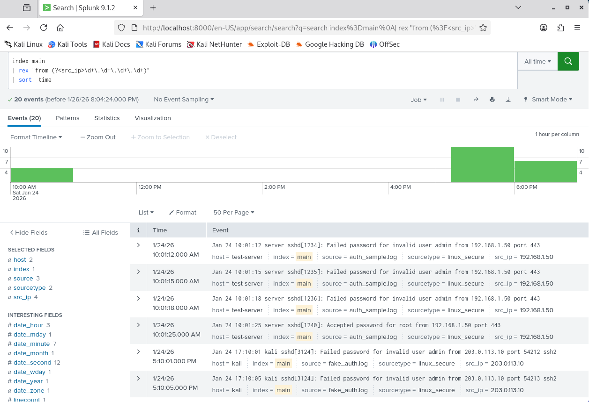

# Splunk SIEM Log Triage & Detection Engineering, MITRE ATT&CK Mapped


## 📌 Project Overview


- This project demonstrates SOC analyst capabilities using **Splunk Enterprise** to perform real-world log triage, detect SSH brute-force activity, and map attacker behaviour to the **MITRE ATT&CK framework**.  

- The workflow simulates an enterprise-style incident investigation using Linux authentication logs, covering detection logic, SPL query development, alert correlation, and structured incident documentation.  

- The focus is on the **full SOC investigation workflow**: from raw log ingestion through threat detection, timeline reconstruction, and MITRE ATT&CK classification, not basic tool usage.

---

## 🎯 Objectives
- Ingest and parse Linux SSH authentication logs into Splunk  
- Detect brute-force attack patterns using custom SPL detection queries  
- Correlate failed and successful login events to identify potential account compromise  
- Reconstruct the full attack timeline to support incident response decisions  
- Map all observed attacker behaviour to MITRE ATT&CK techniques  
- Produce structured investigation findings aligned to SOC reporting standards  

---

## 🖥️ Environment

| Component        | Detail |
|------------------|--------|
| **SIEM Platform** | Splunk Enterprise |
| **Log Source**    | Linux SSH authentication logs (simulated lab environment) |
| **Log Type**      | SSH authentication events (failed and successful) |
| **Operating System** | Kali Linux |
| **Framework**     | MITRE ATT&CK v14 |

---

## 🔍 Detection Use Cases
- Multiple failed SSH login attempts from a single source IP  
- Brute-force attempts targeting invalid usernames  
- Successful login following repeated authentication failures  
- Full timeline correlation of attack progression  

---

## 🗂️ MITRE ATT&CK Mapping

| Technique ID | Technique Name | Observed Behaviour |
|--------------|----------------|--------------------|
| **T1110**    | Brute Force    | High-volume failed SSH login attempts from single source IP |
| **T1078**    | Valid Accounts | Successful authentication observed following brute-force sequence |
| **T1021.004**| Remote Services: SSH | SSH used as the primary remote access method throughout the attack |

---

## 📜 SPL Detection Queries

### 🔑 Detect SSH Brute Force - T1110
```spl
index=main "Failed password"
| rex "from (?<src_ip>\d+\.\d+\.\d+\.\d+)"
| stats count by src_ip
| where count > 10
| sort - count
```
#### Purpose: Identifies source IPs generating high volumes of failed SSH authentication attempts primary indicator of brute-force activity.

---

### 🔑 Correlate Failed to Successful Login - T1078
```spl
index=main ("Failed password" OR "Accepted password")
| rex "from (?<src_ip>\d+\.\d+\.\d+\.\d+)"
| stats values(message) as activity by src_ip
| where mvcount(activity) > 1
```
#### Purpose: Surfaces IPs that appear in both failed and successful login events, high-priority indicator of potential credential compromise following brute-force.

---

### 🔑 Full Attack Timeline Reconstruction
```spl
index=main
| rex "from (?<src_ip>\d+\.\d+\.\d+\.\d+)"
| rex "(?<action>Failed password|Accepted password)"
| table _time src_ip action
| sort _time
```
#### Purpose: Chronological view of all authentication events per source IP, supports full incident timeline reconstruction and escalation documentation.

---
# 📊 Investigation Findings

| Finding                       | Detail                                                                 |
|-------------------------------|-------------------------------------------------------------------------|
| **Brute-force source IP**     | Single external IP responsible for all failed attempts                  |
| **Attack pattern**            | Repeated failed attempts against multiple invalid usernames             |
| **Credential compromise**     | Successful login observed following brute-force sequence                |
| **MITRE classification**      | T1110 → T1078 → T1021.004 attack chain confirmed                        |
| **Escalation recommendation** | Isolate source IP, review account activity, reset compromised credentials |

---

# 🖼️ Investigation Screenshots

### 1. Log Ingestion & Dataset Overview
- Simulated Linux SSH authentication logs successfully ingested into Splunk.  
- Dataset contains both failed and successful login events across multiple source IPs, providing a realistic enterprise log environment for SOC-level triage.  

### 2. SSH Brute Force Detection, T1110
- SPL query identifies multiple failed login attempts grouped by source IP.  
- High failure count from single IP confirms automated brute-force behaviour rather than human error.  

### 3. Failed to Successful Login Correlation, T1078
- Correlation query surfaces IPs present in both failed and successful login events.  
- Reveals attacker progression from brute-force to valid account access, high-priority escalation indicator.  

### 4. Attack Timeline Reconstruction
- Chronological timeline of all authentication events.  
- Documents initial brute-force phase, escalation point, and moment of successful access for SOC reporting.  

---
## Screenshots & Observations

### 1. Fake Log Ingestion
  
**Observation:** Simulated Linux authentication logs were ingested into Splunk successfully. The dataset contains both failed and successful SSH login attempts, providing a realistic environment for SOC-level analysis.

### 2. SSH Brute Force Detection (T1110)
  
**Observation:** SPL query identifies multiple failed login attempts by source IP. High failure count indicates brute-force attack patterns.

### 3. Failed to Successful Login Correlation (T1078)
  
**Observation:** Correlating failed and successful logins reveals potential account compromise. SOC analysts can track attacker progression from brute-force to valid authentication.

### 4. Attack Timeline Investigation
  
**Observation:** Timeline visualization shows sequence of login attempts and successful authentication. Supports incident reconstruction and threat analysis.

---

# 🛠️ Key Skills Demonstrated

- Splunk SIEM log ingestion, parsing, and index configuration  
- SPL query development for threat detection and investigation  
- Security event triage and alert prioritisation  
- MITRE ATT&CK technique mapping and attack chain analysis  
- Incident timeline reconstruction  
- SOC-style investigation documentation and reporting

---

### Author: Shaheen Bakhsh - Cybersecurity Analyst
